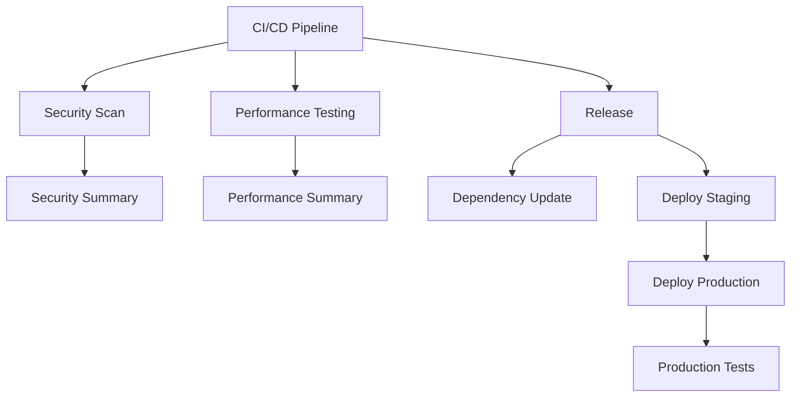

# GitHub Actions Workflows

This directory contains GitHub Actions workflows for the Notarius project's CI/CD pipeline.

## Workflows Overview

### 1. CI/CD Pipeline (`ci.yml`)

The main CI/CD pipeline that runs on every push and pull request.

**Triggers:**
- Push to `main` or `develop` branches
- Pull requests to `main` or `develop` branches

**Jobs:**
- **Lint**: Code quality checks (Python, Node.js, security)
- **Test**: Unit tests for all components
- **Integration Test**: Integration tests between services
- **PII Test**: PII protection mechanism tests
- **Contract Test**: API contract tests
- **E2E Test**: End-to-end workflow tests
- **Build**: Docker image building and pushing to ECR
- **Deploy Staging**: Deploy to staging environment
- **Deploy Production**: Deploy to production environment
- **Security Scan**: Container vulnerability scanning
- **Performance Test**: Performance testing on staging
- **RAG Evaluation**: RAG system evaluation

### 2. Security Scan (`security.yml`)

Comprehensive security scanning workflow.

**Triggers:**
- Push to `main` or `develop` branches
- Pull requests to `main` or `develop` branches
- Weekly schedule (Monday at 2 AM)

**Jobs:**
- **Dependency Scan**: Python and Node.js dependency vulnerability scanning
- **Container Scan**: Docker image vulnerability scanning with Trivy
- **Code Quality Scan**: Code security analysis with Bandit and Semgrep
- **Infrastructure Scan**: Terraform security scanning with Checkov
- **PII Protection Scan**: PII protection mechanism testing
- **Compliance Scan**: GDPR and SOC 2 compliance checking
- **Security Summary**: Aggregated security report

### 3. Release (`release.yml`)

Automated release workflow for production deployments.

**Triggers:**
- Push of version tags (e.g., `v1.0.0`)
- Manual workflow dispatch

**Jobs:**
- **Create Release**: Create GitHub release with changelog
- **Build Images**: Build and push Docker images to ECR
- **Update Helm Charts**: Update Kubernetes Helm charts
- **Deploy Staging**: Deploy to staging environment
- **Smoke Tests**: Run smoke tests on staging
- **Deploy Production**: Deploy to production environment
- **Production Tests**: Run production validation tests
- **Update Release Notes**: Update release with deployment status
- **Notify Success/Failure**: Send notifications

### 4. Dependency Update (`dependency-update.yml`)

Automated dependency update workflow.

**Triggers:**
- Weekly schedule (Monday at 2 AM)
- Manual workflow dispatch

**Jobs:**
- **Update Python Dependencies**: Update Python packages with Poetry
- **Update Node.js Dependencies**: Update Node.js packages with npm
- **Update Docker Images**: Update Docker base images
- **Security Updates**: Apply security patches
- **Summary**: Generate update summary

### 5. Performance Testing (`performance.yml`)

Comprehensive performance testing workflow.

**Triggers:**
- Push to `main` or `develop` branches
- Pull requests to `main` or `develop` branches
- Weekly schedule (Sunday at 4 AM)
- Manual workflow dispatch

**Jobs:**
- **Load Test**: Load testing with Locust
- **Stress Test**: Stress testing with Locust
- **API Performance Test**: API endpoint performance testing
- **Database Performance Test**: Database query performance testing
- **Memory Usage Test**: Memory usage analysis
- **CPU Usage Test**: CPU usage analysis
- **Response Time Test**: Response time measurement
- **Performance Summary**: Aggregated performance report

## Workflow Features

### Security

- **Dependency Scanning**: Automated vulnerability scanning
- **Container Scanning**: Docker image security analysis
- **Code Analysis**: Static code analysis for security issues
- **Infrastructure Scanning**: Infrastructure security validation
- **PII Protection**: PII protection mechanism testing
- **Compliance**: Regulatory compliance checking

### Quality Assurance

- **Linting**: Code quality and style checking
- **Testing**: Comprehensive test suite execution
- **Contract Testing**: API contract validation
- **Integration Testing**: Service integration validation
- **E2E Testing**: End-to-end workflow testing
- **Performance Testing**: Performance and load testing

### Deployment

- **Multi-Environment**: Staging and production deployments
- **Blue-Green**: Zero-downtime deployments
- **Rollback**: Automatic rollback on failure
- **Health Checks**: Post-deployment validation
- **Monitoring**: Deployment monitoring and alerting

### Automation

- **Dependency Updates**: Automated dependency updates
- **Security Patches**: Automated security patch application
- **Release Management**: Automated release creation
- **Notification**: Success/failure notifications
- **Artifact Management**: Test reports and build artifacts

## Environment Configuration

### Required Secrets

- `AWS_ACCESS_KEY_ID`: AWS access key for deployment
- `AWS_SECRET_ACCESS_KEY`: AWS secret key for deployment
- `GITHUB_TOKEN`: GitHub token for repository access
- `STAGING_URL`: Staging environment URL
- `PRODUCTION_URL`: Production environment URL

### Environment Variables

- `PYTHON_VERSION`: Python version (3.11)
- `NODE_VERSION`: Node.js version (18)
- `DOCKER_BUILDKIT`: Docker BuildKit enabled

## Workflow Dependencies



## Best Practices

### Security

1. **Least Privilege**: Use minimal required permissions
2. **Secret Management**: Store secrets in GitHub Secrets
3. **Dependency Scanning**: Regular vulnerability scanning
4. **Container Security**: Secure container images
5. **Infrastructure Security**: Secure infrastructure configuration

### Quality

1. **Test Coverage**: Maintain high test coverage
2. **Code Quality**: Enforce code quality standards
3. **Performance**: Regular performance testing
4. **Documentation**: Keep documentation updated
5. **Monitoring**: Monitor application health

### Deployment

1. **Staging First**: Deploy to staging before production
2. **Health Checks**: Validate deployments
3. **Rollback Plan**: Have rollback procedures
4. **Monitoring**: Monitor deployment success
5. **Notification**: Notify on success/failure

## Troubleshooting

### Common Issues

1. **Build Failures**: Check dependencies and configuration
2. **Test Failures**: Review test logs and fix issues
3. **Deployment Failures**: Check infrastructure and permissions
4. **Security Failures**: Address security vulnerabilities
5. **Performance Issues**: Optimize performance bottlenecks

### Debug Commands

```bash
# Check workflow status
gh run list

# View workflow logs
gh run view <run-id>

# Rerun failed workflow
gh run rerun <run-id>

# Cancel running workflow
gh run cancel <run-id>
```

## Contributing

### Adding New Workflows

1. Create new workflow file in `.github/workflows/`
2. Define triggers and jobs
3. Add required secrets and environment variables
4. Test workflow in development
5. Document workflow purpose and usage

### Modifying Existing Workflows

1. Test changes in development
2. Update documentation
3. Review security implications
4. Test deployment process
5. Monitor workflow execution

## Monitoring

### Workflow Metrics

- **Success Rate**: Percentage of successful runs
- **Execution Time**: Average workflow execution time
- **Failure Rate**: Percentage of failed runs
- **Resource Usage**: CPU and memory usage
- **Cost**: GitHub Actions usage cost

### Alerts

- **Workflow Failures**: Immediate notification
- **Security Issues**: Security team notification
- **Performance Degradation**: Performance team notification
- **Deployment Failures**: Operations team notification

## Cost Optimization

### Strategies

1. **Parallel Execution**: Run jobs in parallel
2. **Caching**: Cache dependencies and build artifacts
3. **Conditional Execution**: Skip unnecessary jobs
4. **Resource Optimization**: Use appropriate runner sizes
5. **Cleanup**: Clean up old artifacts and logs

### Monitoring

1. **Usage Tracking**: Monitor GitHub Actions usage
2. **Cost Analysis**: Analyze workflow costs
3. **Optimization**: Identify optimization opportunities
4. **Budget Alerts**: Set budget alerts
5. **Reporting**: Regular cost reporting

## Support

For issues and questions:

1. Check workflow logs
2. Review documentation
3. Consult team members
4. Create GitHub issue
5. Contact operations team
